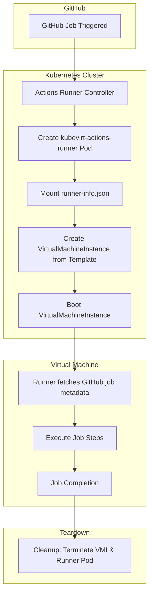

# Kubevirt Actions Runner

<!-- markdown-link-check-disable-next-line -->

[](https://opensource.org/licenses/Apache-2.0)
[](https://github.com/marketplace/actions/super-linter)

<!-- markdown-link-check-disable-next-line -->


[](https://github.com/boyter/scc/)
[](https://github.com/boyter/scc/)

## Overview

`kubevirt-actions-runner` is a custom GitHub Actions runner image designed for use with the [Actions Runner Controller (ARC)](https://github.com/actions/actions-runner-controller).
This runner provisions ephemeral virtual machines (VMs) using [KubeVirt](https://kubevirt.io), extending the flexibility and security of your CI/CD workflows.

This is particularly useful for validating scenarios that are not supported by default GitHub-hosted runners, such as:

- Running Windows or macOS jobs
- Custom environments that require specific kernel modules or system services
- Jobs requiring strong isolation from the host system

## Key Features

- _Ephemeral VM creation_: Launch a fresh VM for every job and destroy it after completion
- _Increased isolation_: Ideal for untrusted code or complex system configurations
- Custom system-level configuration support
- Easily integrates with ARC and Kubernetes-native tooling

## Prerequisites

To use this project, ensure you have the following installed:

- A working Kubernetes cluster
- [Actions Runner Controller](https://github.com/actions/actions-runner-controller/blob/master/docs/quickstart.md)
- [KubeVirt](https://kubevirt.io/quickstart_cloud)

## Quick Start Guide

### 1. Create VirtualMachine template

This template will be used to spawn VMs on-demand for each GitHub job. The base `VirtualMachine` will never be started; instead, clones of it will be launched as `VirtualMachineInstances`.

```bash
# Create namespace if it doesn't exist
! kubectl get namespace "${namespace}" && kubectl create namespace "${namespace}"

# Apply the VM template
kubectl apply -f scripts/vm_template.yml -n "${namespace}"
```

Example snippet from `vm_template.yml`:

```yaml
apiVersion: kubevirt.io/v1
kind: VirtualMachine
metadata:
  name: ubuntu-jammy-vm
spec:
  runStrategy: Manual
  template:
    spec:
      domain:
        devices:
          filesystems:
            - name: runner-info
              virtiofs: {}
```

The `runner-info` volume is mounted at runtime and contains metadata required by the GitHub Actions runner, e.g.:

```json
{
  "name": "runner-abcde-abcde",
  "token": "AAAAAAAAAAAAAAAAAAAAAAAAAAAAA",
  "url": "https://github.com/org/repo",
  "ephemeral": true,
  "groups": "",
  "labels": ""
}
```

### 2. Configure RBAC for KubeVirt Access

The service account used by the runner pods must be granted permissions to manage KubeVirt VMs.

```yaml
apiVersion: v1
kind: ServiceAccount
metadata:
  name: kubevirt-actions-runner
---
apiVersion: rbac.authorization.k8s.io/v1
kind: Role
metadata:
  name: kubevirt-actions-runner
rules:
  - apiGroups: ["kubevirt.io"]
    resources: ["virtualmachines"]
    verbs: ["get", "watch", "list"]
  - apiGroups: ["kubevirt.io"]
    resources: ["virtualmachineinstances"]
    verbs: ["get", "watch", "list", "create", "delete"]
  - apiGroups: ["cdi.kubevirt.io"]
    resources: ["datavolumes"]
    verbs: ["get", "watch", "list", "create", "delete"]
---
apiVersion: rbac.authorization.k8s.io/v1
kind: ClusterRole
metadata:
  name: cdi-cloner
rules:
  - apiGroups: ["cdi.kubevirt.io"]
    resources: ["datavolumes/source"]
    verbs: ["create"]
```

### 3. Deploy the Runner scale set

Use Helm to install the GitHub Actions runner scale set.

Create a values.yml file:

```yaml
githubConfigUrl: https://github.com/<your_enterprise/org/repo>
githubConfigSecret: <your_github_secret>

template:
  spec:
    serviceAccountName: kubevirt-actions-runner
    containers:
      - name: runner
        image: electrocucaracha/kubevirt-actions-runner:latest
        command: []
        env:
          - name: KUBEVIRT_VM_TEMPLATE
            value: ubuntu-jammy-vm
          - name: RUNNER_NAME
            valueFrom:
              fieldRef:
                fieldPath: metadata.name
```

Install using Helm:

```bash
helm upgrade --create-namespace --namespace "${namespace}" \
    --wait --install --values values.yml vm-self-hosted \
    oci://ghcr.io/actions/actions-runner-controller-charts/gha-runner-scale-set
```

## Architecture Diagram



## Limitations

- _macOS support_: macOS virtualization is not supported via KubeVirt due to licensing constraints.
- _Long job durations_: Boot time of VMs may increase total runtime.
- _Persistent state_: Not designed for workflows requiring persisted state between jobs.

## Contributing

Contributions are welcome! Please open issues or submit PRs to help improve this project.

## How to setup a development environment

This project includes **Dev Container** support, making it easy to get started with a fully configured development environment. This ensures consistency across development setups and allows contributors to begin working without manual environment configuration.

### Option 1: GitHub Codespaces

You can launch a cloud-based development environment instantly:

[](https://github.com/codespaces/new?repo=electrocucaracha/kubevirt-actions-runner)

### Option 2: Local Dev Container (Visual Studio Code)

1. Install [Visual Studio Code](https://code.visualstudio.com/).
1. Install the [Dev Containers extension](https://marketplace.visualstudio.com/items?itemName=ms-vscode-remote.remote-containers).
1. Ensure you have a container runtime installed and running:
   - [Docker Desktop](https://www.docker.com/products/docker-desktop/) (Windows/macOS)
   - [Docker Engine](https://docs.docker.com/engine/install/) or [Podman](https://podman.io/) (Linux)
1. Open this repository in Visual Studio Code.
1. When prompted, reopen the project in a Dev Container.

## Presentations

### KCD Guadalajara 2025 – Migrating GitHub Actions with Nested Virtualization to the Cloud-Native Ecosystem

This project was presented at [Kubernetes Community Days (KCD) Guadalajara 2025](https://community.cncf.io/events/details/cncf-kcd-guadalajara-presents-kcd-guadalajara-2025/cohost-kcd-guadalajara), showcasing how to extend GitHub Actions with KubeVirt and nested virtualization to support custom and complex CI/CD workflows in Kubernetes.

- [Video (Spanish)](https://www.youtube.com/watch?v=ccb8y_Ij30k)
- [Slides](https://www.slideshare.net/slideshow/migrating-github-actions-with-nested-virtualization-to-cloud-native-ecosystem-pptx/277448656)

The presentation walks through:

- Challenges with standard GitHub-hosted runners
- Benefits of using KubeVirt for GitHub Actions runners
- Live demo deploying and running jobs inside ephemeral VMs
- Lessons learned and architectural considerations
